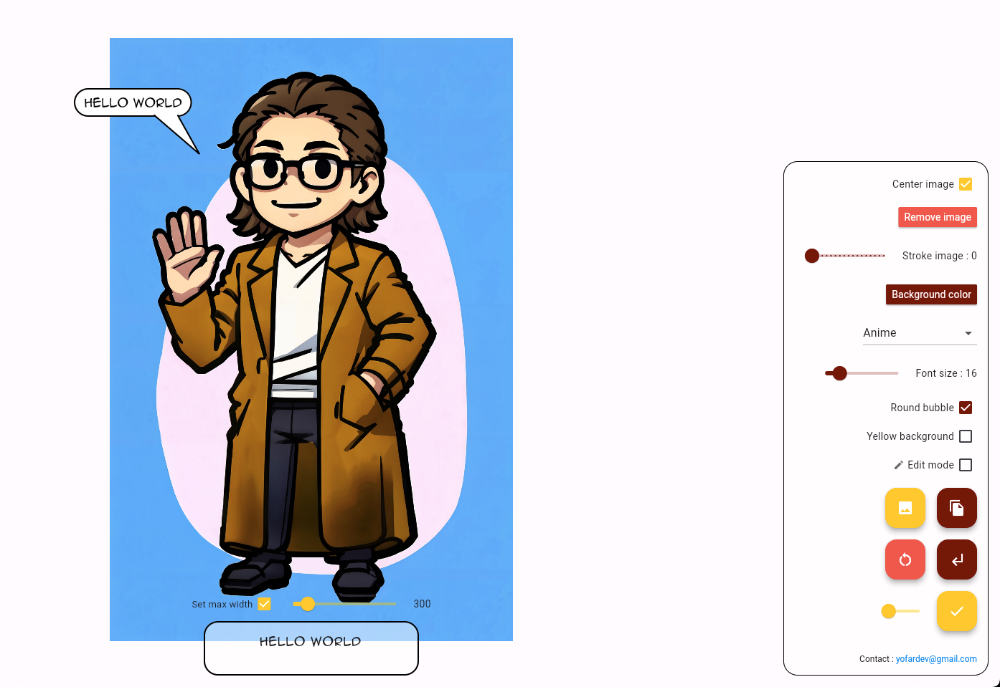

# Bubble Yofardev

This is a free, user-friendly tool designed to quickly add comic-style bubble text to images. The tool is developed using Flutter and is [available online](https://bubble-yofardev.web.app/) for free, with a desktop version coming soon.
(I did this tool quickly and only for me at first and didn't plan to share it, neither to release the code, so don't judge me on its quality 😁)



## Features

* **Easy to Use** : Intuitive interface for adding comic bubbles to any image.
* **Customizable Bubbles** : Various bubble shapes, colors, and fonts to choose from.
* **Drag-and-Drop Interface** : Simply drag and drop your image into the tool.
* **CSV Export and Import** : Save your work as a CSV file, allowing you to reload and edit it later.
* **Online Access** : Accessible via [Bubble Text Tool](https://bubble-yofardev.web.app/).
* **Coming Soon** : Desktop version for offline use.

## Getting Started

### Online Version

1. **Visit the Web App**: Open [Bubble Text Tool](https://bubble-yofardev.web.app/) in your browser.
2. **Upload Your Image**: Drag and drop your image or click to upload.
3. **Add Bubbles**: Use the tools provided to add and customize comic bubbles.
4. **Download**: Save your edited image with the comic bubbles.

### Desktop Version

The desktop version is currently under development and will be available soon. Stay tuned for updates!

## Development

### Prerequisites

To run the project locally, you need to have Flutter installed. Follow the [official Flutter installation guide](https://flutter.dev/docs/get-started/install) to set up Flutter on your machine.

### Installation

1. **Clone the Repository**:

   ```bash
   git clone https://github.com/yourusername/bubble-text-tool.git
   cd bubble-text-tool
   ```
2. **Install Dependencies**:

   ```bash
   flutter pub get
   ```
3. **Run the App**:

   ```bash
   flutter run
   ```

## Contributing

We welcome contributions! If you would like to contribute to this project, please follow these steps:

1. Fork the repository.
2. Create a new branch (`git checkout -b feature-branch`).
3. Make your changes.
4. Commit your changes (`git commit -m 'Add new feature'`).
5. Push to the branch (`git push origin feature-branch`).
6. Open a Pull Request.

## License

This project is licensed under the MIT License. See the [LICENSE](LICENSE) file for details.

## Contact

For any questions or suggestions, feel free to open an issue or contact us at yofardev@gmail.com

Thank you for using the Bubble Text Tool!

(this readme was generated using chatGPT)
